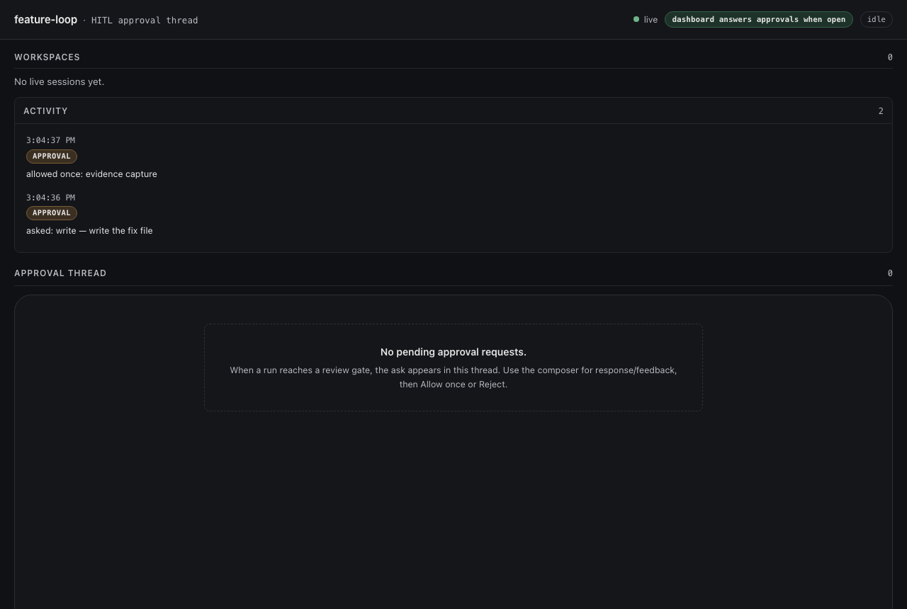

# VERIFY — standalone dashboard answers an approval

The claim in #19 is behavioural: *the loopback dashboard can settle an ask*. A
behavioural claim needs a transcript and a picture, not an exit code. This is
that evidence, all of it captured from a real run on a real machine.

Everything here is regenerable:

```bash
node --experimental-strip-types test/capture-standalone-evidence.mjs   # transcript + screenshot
bash test/integration/run.sh                                          # 11/11
make e2e-dashboard                                                    # real Chromium click
```

The capture script exits non-zero if any line below contradicts it, so it is a
check, not a transcript of something that was true once.

---

## 1. The loopback server now answers

`docs/evidence/standalone-dashboard.md` — the full transcript. The load-bearing
lines:

| Result | Observation |
|---|---|
| `false` | watcher flag before any tab connects |
| `401` | `GET /api/state` with no token |
| `200` | `GET /?token=…` — the page renders |
| `200` | `GET /api/state` — **`answers=true`**, pending=0 |
| `true` | watcher flag while a tab is connected |
| `1` | `GET /api/state` — **the tab claimed the ask** |
| `200` | `POST /api/approvals/:id {allowed-once}` → `{"ok":true,"outcome":"allowed-once"}` |
| `allowed-once` | **the ask promise resolved with the clicked outcome** |
| `409` | POST the same id again — a late click reads as "you were beaten" |
| `403` | POST with a cross-origin `Origin` |
| `false` | watcher flag after the last tab closed — the fix's close half |

Three of these were impossible before:

- **`answers=true`.** `plugin.ts` used to force `answers: false` on the
  standalone server, so the page advertised itself as observe-only.
- **The tab claimed the ask.** `noteWatcher()` was only ever called from
  `remote.ts` (the in-UI page), so the registry's `hasWatcher()` was
  permanently false on the loopback path and the page was never given an ask.
- **The flag is released on close.** Registering without clearing left it set
  for the life of the process — a dashboard nobody had open would beat the
  composer panel to every ask, then strand it.

## 2. A real browser



`docs/evidence/standalone-dashboard.png` — 1280×860, real Chromium, rendered
from the same server.

The badge top-right reads **"dashboard answers approvals when open"**. That is
the `answers: false` override being gone, visible in the UI rather than in a
diff. The activity log carries the real ask (`asked: write — write the fix
file`) and the real decision (`APPROVAL allowed-once: evidence capture`).

`make e2e-dashboard` drives the same page and clicks the actual buttons:

```
e2e-dashboard (allowed-once): the Allow once click resolved the ask allowed-once
e2e-dashboard (rejected): the Reject click resolved the ask rejected
```

## 3. The integration suite, against a real harness

`docs/evidence/03-integration-11-of-11.log`

```
Test Files  1 passed (1)
     Tests  11 passed (11)
```

Five of the eleven never passed on `v0.1.2`. This is the suite that ships red
today.

## 4. How the loop found this

`docs/evidence/loop/` — the run that produced this branch, kept because the
finding path is part of the evidence.

| File | What it shows |
|---|---|
| `task.txt` | what the loop was asked to build |
| `01-plugin-failed-to-import.log` | the plugin **failing to import** — `ERR_MODULE_NOT_FOUND` on a code-split chunk the published tarball did not contain |
| `02-loop-reasoning.log` | the loop running, reading the code, and diagnosing the `standalone: true` and `answers: false` gaps correctly on its own, before dying on a harness message-format error |

`01` is the packaging bug: `files[]` named five exact `lib/` paths while the
build emits content-hashed chunks, so the published package could not be
imported at all. It is fixed in the same branch.

`02` is worth reading in full. The loop's own conclusion — that adding
`standalone: true` to the spec is *not* weakening the test, because the test
drives the standalone HTTP surface — was correct, and it independently reached
the `answers: false` question that turned out to be the second real bug.

## What this does not prove

- **The loop's own telemetry reported `steps: 0, costUSD: 0`** for a run that
  plainly did work. The `budget.spend` wiring exists at `plugin.ts:639`, but the
  counters did not move on the plugin path. Unfixed, and tracked separately.
- **The gate refused a read-only `wc -l src/*.ts`** as `irreversible`, which
  blocked the loop mid-task. The reversibility classifier is too coarse for
  unattended runs. Visible in `02-loop-reasoning.log`.
- The screenshots are a real browser on one machine, not a visual regression
  suite.
