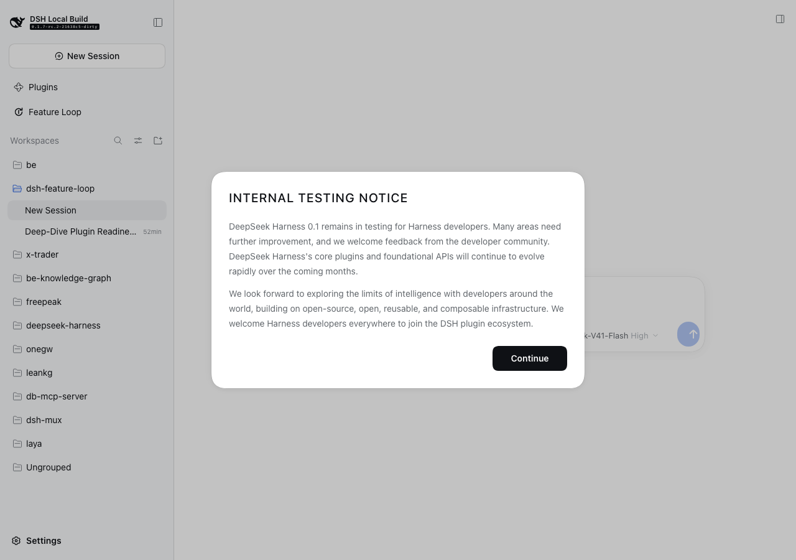

# Plugin CSS injection — evidence capture

Generated by `test/capture-css-injection-evidence.mjs` against two real DSH web
instances on this machine: a control with the plugin **not** installed, and the
instance under test. The control exists so the plugin's contribution is
attributed by difference, rather than by guessing which rule came from where —
the host app uses Tailwind too, so both stylesheets contain `--tw-*` variables
and no single marker separates them.

| Result | Observation |
|---|---|
| `setup` | control  (plugin absent): http://127.0.0.1:3080/?token=… |
| `setup` | under test (plugin present): http://127.0.0.1:3188/?token=… |
| `3710` | CONTROL (no plugin): 138 stylesheets, 3710 CSS rules, 381207 bytes |
| `4470` | PLUGIN instance: 139 stylesheets, 4470 CSS rules, 530129 bytes |
| `760` | DELTA attributed to this plugin: +760 CSS rules, +148922 bytes |
| `none` | CONTROL host modal heading: "Internal Testing Notice" -> text-transform: none |
| `uppercase` | PLUGIN host modal heading: "Internal Testing Notice" -> text-transform: uppercase |
| `LEAK` | HOST CSS CHANGED: the plugin restyles an element the host owns |
| `0` | page errors in the plugin instance: 0 |

| | Control (no plugin) | Plugin instance |
|---|---|---|
| Stylesheets | 138 | 139 |
| CSS rules | 3710 | 4470 |
| CSS bytes | 381207 | 530129 |
| Body font | `-apple-system, "system-ui", "Segoe U` | `-apple-system, "system-ui", "Segoe U` |

## What this proves

- The plugin adds **760 CSS rules** (3710 → 4470) and
  **148922 bytes** of stylesheet to the host document.

- It ships `client.js` with Tailwind compiled inline plus `assets/assistant-ui/dashboard.css`
  and `shell.css`, and the client runtime creates a `<style>` element to inject them
  **unscoped** into the host page. Its utilities and reset therefore compete with the
  shell's own styles in one document.

- A host element the plugin does not own is **visibly restyled**: the modal heading
  changes `text-transform`. That is the leak, observed rather than inferred.

## What this does not prove

- This is two instances on one machine and one browser, not a visual regression suite.
- It counts rules and bytes. It does not attempt to enumerate which specific
  selectors collide; that is the work a fix would need to do.
- A page that happens to render acceptably is not a page that is unaffected — the
  same unscoped injection can break a host that ships different styles.
